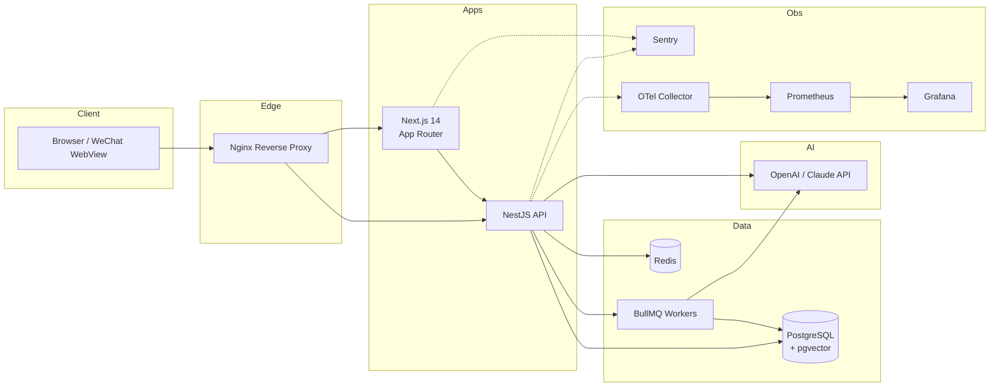
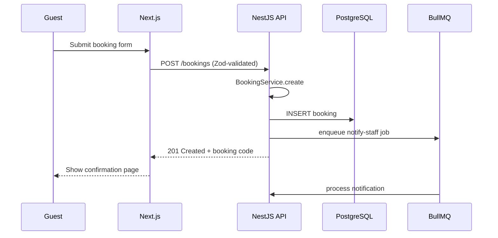

# System Overview

## High-level architecture

## Bounded contexts

- **identity**: User (staff), Customer (guest)
- **campsite**: Package, PackageItem, PickupLocation
- **booking**: Booking, Order, OrderItem, Payment
- **ai**: Conversation, Message, KnowledgeDoc, KnowledgeChunk

## Request lifecycle (booking creation)

